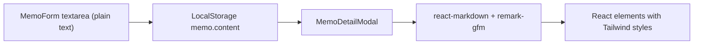

# 메모 상세 보기에 마크다운 프리뷰 추가

## 1. 라이브러리 선정 (context7 조사 완료)

- 채택: **react-markdown@^9** + **remark-gfm@^4**
- 근거: React 엘리먼트로 변환되어 XSS 안전 / 평판 High, Benchmark 85.5 / GFM(테이블·체크리스트·취소선·자동링크) 지원 / Next.js 15 + React 19 호환
- 탈락: markdown-it·marked는 HTML 문자열 반환이라 dangerouslySetInnerHTML 필요 (메모 콘텐츠에 XSS 위험)

## 2. 의존성 추가

```bash
npm install react-markdown remark-gfm
```

`[package.json](package.json)`의 dependencies에 두 패키지가 추가됩니다.

## 3. 수정 대상

### `[src/components/MemoDetailModal.tsx](src/components/MemoDetailModal.tsx)` (수정)

현재 본문 영역(파일 내 약 151~154행)에서 단순 `<p>`로 `memo.content`를 출력하고 있는데, 이를 `<Markdown remarkPlugins={[remarkGfm]} components={...}>{memo.content}</Markdown>` 으로 교체합니다.

스타일링은 components prop으로 각 HTML 태그별 Tailwind 클래스를 매핑 (의존성 최소화 방침).

매핑 대상 태그:
- h1/h2/h3 — 크기·여백·굵기
- p — `text-sm text-gray-800 leading-relaxed mb-3`
- ul/ol/li — 들여쓰기·마커
- a — `text-blue-600 hover:underline`, `target="_blank" rel="noreferrer"`
- 인라인 code — `bg-gray-100 px-1.5 py-0.5 rounded text-xs`
- pre (코드 블록) — `bg-gray-900 text-gray-100 p-3 rounded-lg overflow-x-auto text-xs`
- blockquote — `border-l-4 border-gray-300 pl-3 italic text-gray-600`
- table/thead/th/td — 테두리·패딩 (remark-gfm)
- 체크박스 input — 체크리스트 (remark-gfm)
- hr — `my-4 border-gray-200`
- strong·em·del

추가 변경:
- 상단에 `import Markdown from 'react-markdown'`, `import remarkGfm from 'remark-gfm'` 추가
- 기존 `whitespace-pre-wrap` 제거 (마크다운 파서가 줄바꿈 처리)

### 변경하지 않는 파일

- `[src/components/MemoForm.tsx](src/components/MemoForm.tsx)` — 편집·작성은 plain text textarea 유지 (사용자가 마크다운 문법을 직접 입력)
- `[src/components/MemoItem.tsx](src/components/MemoItem.tsx)` — 카드 미리보기는 plain text 유지 (질문 선택 결과)

## 4. 데이터 흐름



저장 형식은 그대로 마크다운 원문, 렌더링 시점에만 변환. 마이그레이션 불필요.

## 5. 검증 포인트

- 기존 샘플 데이터(`[src/utils/seedData.ts](src/utils/seedData.ts)`)의 plain text 메모가 깨지지 않고 표시되는지 (마크다운 문법이 없는 텍스트는 그대로 단락으로 렌더링됨)
- ESC/오버레이 클릭/X 닫기 동작이 그대로 유지되는지
- 코드블록·테이블·체크리스트가 정상 렌더링되는지
- `npm run lint` 통과

## 6. 작업 후 산출물 목록

- 수정: `[src/components/MemoDetailModal.tsx](src/components/MemoDetailModal.tsx)`
- 수정: `[package.json](package.json)` (+ `package-lock.json`) — react-markdown, remark-gfm 추가
- 신규 파일 없음